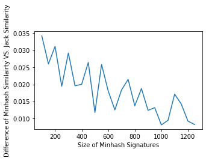
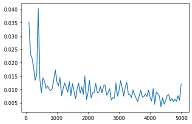

# ColorHistogram January 10, 2020

Original Image to be Compared with: a3160402803.jpg
Differentiated image from original image are: a111111 ~ a999999.jpg
Totally different product images: a1650052227.jpg, a32420846530.jpg, a5042835581.jpg, a87651420677.jpg, a894047001034.jpg, a898440001028.jpg

In this update:
1) Added counter of number of distinct colors in each image

2) Added timer of duration of RGB hash to integers

3) Added timer of duration of MinHash Signature Calculation for each image

4) Added counter of number of pixels in each image

5) Added "AverageDifferenceBySize" class to test how the trend of the difference between Minhash Similarity VS. Real Jaccard Similarity will look like by changing "Size"(size of Minhash Signatures)

	a) In MainActivity.java, from Line 153 to Line 180

	b) It will print the size starting from being 100, adding 50 each time, and ending at 1250

	c) It will print the corresponding absolute values of Minhash Similarity - Jaccard Similarity, which shows how much difference/error is the MinHash Similarity to the Jaccard Similarity

	d) Please see attached result trending image "accuracyDifferenceTrend.png" in the following message.

	c) It generally shows a linear decrease of the difference between the MinHash Similrity to the Jaccard Similarity, in short term (size increases from 100 to 1250).
	   But, more like a quadratic shape in longer term (size increases from 100 to 5000, please see image "longterm_accuracyDifferenceTrend.png"

I/System.out: Minhash value of image of a111111 is: [216940409, 35612622, 421478, 6002977, 1285049, 4837227, 9436932, 7264775, 12219508, 1208643, 5455919, 1232739, 5135887, 8817421, 12641442, 11698488, 12975012, 717969, 5939115, 5047541, 11377478, 295385, 784824, 206115, 826711, 683028, 2448088, 12434229, 8932490, 5241719, 578193, 7911788, 1869691, 17282014, 585689, 1237548, 1384084, 8627020, 3830511, 8231929, 982369, 8516879, 7271308, 2554901, 5347074, 1212512, 80538, 1683828, 24679682, 4665691, 3660615, 6203260, 945641, 7685019, 3142858, 6910447, 807648, 437543, 3092343, 3215526, 9603404, 5654094, 966563, 16718451, 11204544, 2893536, 1426754, 7599999, 1617498, 3392419, 4800244, 557637, 18227869, 1495173, 9994774, 961473, 4793127, 6354277, 7288874, 13160401, 4043868, 3646162, 1110785, 2151356, 1362417, 15945519, 6667364, 8879428, 2749255, 13868510, 984335, 1618800, 3413629, 9238779, 542300, 14426720, 2175492, 1715448, 1253140, 9845650, 28493047, 2256246, 1948281, 8976708, 443271, 10296668, 3807248, 7704824, 21880284, 1887739, 7109691, 3443884, 20685466, 4228453, 17890548, 31858077, 2689157, 8165510, 237216, 6760334, 12658471, 9000325, 3603607, 2424012, 29805808, 809475, 4023195, 4837540, 1893364, 10811062, 1051373, 21220705, 6326845, 15324367, 7459066, 4215003, 4494148, 964698, 1790216, 3680972, 2085340, 7954033, 3185320, 10965371, 2880922, 1551864, 2841080, 1253724, 4397758, 8233424, 1322546, 27852, 2835693, 2434324, 7637108, 6680802, 7532036, 1573677, 971533, 10388354, 4399063, 6140844, 203501, 11041484, 16792819, 14625758, 930400, 2698825, 2062601, 2940929, 1026001, 4843468, 780388, 10409777, 15698247, 366585, 7409418, 6021402, 7972334, 529236, 4674800, 4679209, 427587, 1378641, 1763226, 12121827, 5821632, 7824460, 23759935, 5159150, 8170451, 1732662, 11212430, 5181155, 3070633, 7298935, 2669329, 10636247, 199780, 12542290, 28163368, 5256106, 3768394, 17796664, 2505866, 5324704, 11672789, 2391476, 1656020, 11898700, 117187, 2884035, 8830930, 134658, 1417059, 3729506, 25424191, 5764297, 4062102, 7456074, 464436, 52070799, 6955550, 8769577, 4447445, 4830153, 1639056, 4610300, 2379245, 1852330, 8993580, 1504450, 133735, 8031776, 4331784, 3254383, 4739113, 16530071, 145922, 11067540, 3021329, 2274481, 2162333, 8117923, 6966302, 5404663, 2501719, 9840186, 718898, 5435676, 7100335, 3431184, 2074697, 6466695, 2927154, 8488017, 19437217, 7100739, 9471992, 1212911, 1436706, 5567474, 6937887, 70628, 86715, 3078332, 1694269, 3337911, 3853689, 1422344, 4474023, 3815791, 6917375, 10906074, 1073442, 4410954, 15767725, 92817184, 3806926, 1650861, 5452843, 3564490, 12360414, 482174, 8864877, 3575583, 2070036, 1942118, 3954737, 5183471, 626651, 7587963, 3542969, 5634021, 4806632, 6222378, 5711645, 15915279, 1050564, 1957991, 2938041, 905619, 2847681, 3714953, 1112620, 14374358, 12848050, 2780844, 1143315, 498192, 4285729, 10267553, 4972117, 8017186, 1556382, 11610212, 1697724, 2249621, 5500892, 3270576, 299356, 12124846, 1513538, 16505744, 2143876, 6351316, 39828356, 4037551, 4341474, 4911677, 4730170, 2382521, 319655, 4317039, 1048556, 1391342, 3166871, 20093781, 9439336, 3546578, 35719405, 6885895, 2721662, 2909724, 4153742, 3656129, 15581475, 112462, 11381670, 24359057, 2826048, 1882183, 702447, 9272490, 15943798, 1266875, 9893812, 4134701, 1257978, 1067335, 9947325, 13021466, 3396876, 9479039, 1033026, 4020589, 1900303, 1797144, 242054, 3543960, 8739552, 6423818, 2050470, 25415406, 727695, 40304836, 13905405, 1673590, 1118781, 6885739, 1226982, 3356065, 8370841, 4594918, 7707353, 4716733, 6947020, 2548361, 3451457, 7024928, 13638181, 7603259, 11961890, 6468527, 925265, 895279, 9166152, 2407249, 62897, 1925464, 3991259, 2959760, 8099864, 14118471, 12111589, 2719213, 8916800, 111016, 6129710, 3517177, 2233934, 6359558, 10788196, 993524, 3451091, 2996496, 480454, 56192613, 7827967, 8431844, 2596782, 2619951, 1784162, 2567037, 27511764, 1636133, 654811, 3029977, 6428826, 5817905, 21079492, 5429867, 7559688, 181955, 31816037, 3760230, 1385083, 677150, 628674, 436368, 5872645, 2830625, 4979979, 3146054, 23004
I/System.out: Minhash value of image of a1650052227 is: [216940409, 23013024, 6046517, 13005203, 2754596, 4837227, 9436932, 7264775, 8335448, 14687976, 16528191, 1232739, 2730244, 367302, 5282948, 8082976, 2871914, 717969, 4966843, 5047541, 5331864, 295385, 784824, 1766376, 826711, 4679199, 2448088, 6551246, 8152544, 5241719, 578193, 3690708, 3475172, 18164735, 4047867, 6506509, 1384084, 7605002, 7428440, 28570669, 982369, 2787936, 7637974, 7718995, 128695, 1212512, 80538, 1683828, 1361593, 4665691, 3660615, 20622544, 945641, 8144943, 11715252, 6910447, 2818305, 437543, 2057306, 3215526, 882150, 5654094, 966563, 11656075, 13088415, 2949661, 1426754, 7599999, 3353057, 14530440, 4800244, 1094810, 10033582, 5531033, 11290860, 961473, 296902, 2328266, 4681703, 3295840, 10179983, 3646162, 1110785, 2151356, 1362417, 11418160, 13334971, 10448376, 2749255, 13868510, 984335, 1618800, 3413629, 1170987, 542300, 12031620, 9252266, 7058444, 1253140, 7473443, 28493047, 2256246, 1948281, 11429787, 2182133, 4059554, 3807248, 19617460, 8570280, 364769, 7109691, 3443884, 20685466, 10208692, 21648022, 18357782, 2689157, 8165510, 17993925, 1430615, 4891305, 8174244, 1958063, 2424012, 3600693, 809475, 4023195, 2838671, 4479482, 45871611, 1051373, 21918948, 6326845, 4089332, 838996, 4215003, 2980122, 22302883, 1790216, 471105, 4745, 7954033, 3185320, 28137378, 720911, 6896989, 2841080, 1253724, 4397758, 20028203, 1450925, 8207347, 2835693, 2434324, 4173343, 7684161, 7532036, 4004209, 971533, 6903980, 10476307, 5863731, 203501, 4927602, 52466835, 14625758, 930400, 6361044, 2062601, 2940929, 1026001, 9936791, 780388, 12687132, 16259649, 9600021, 7409418, 6021402, 5877585, 6047131, 4674800, 4679209, 427587, 1378641, 283124, 12121827, 7590836, 7824460, 2420899, 1368468, 10161501, 1732662, 11212430, 5181155, 753146, 7298935, 11637947, 8498085, 199780, 183038, 21071000, 5256106, 1101087, 12683846, 2280171, 2427607, 8390448, 2269029, 10308613, 3895670, 1779048, 2884035, 8830930, 134658, 1417059, 12775143, 6608988, 34062792, 17117511, 3172913, 464436, 48191814, 6955550, 8769577, 4931602, 4830153, 3860690, 4610300, 2379245, 1852330, 8993580, 1504450, 8995732, 8031776, 4331784, 3254383, 4739113, 6377661, 6167528, 8445460, 414705, 1614564, 2162333, 8837101, 6966302, 5404663, 2501719, 6241666, 718898, 5435676, 28230459, 3431184, 1996766, 6466695, 6016725, 3090518, 1602569, 670194, 2779463, 5936685, 11923880, 6675064, 667229, 70628, 86715, 3078332, 1694269, 12014548, 2696567, 1422344, 1761146, 3815791, 6917375, 10906074, 1073442, 5024427, 9885404, 65537382, 2161065, 1650861, 566969, 5487046, 13414799, 482174, 9527966, 3575583, 7364159, 1942118, 3954737, 989704, 27134916, 5386920, 3542969, 324442, 2550975, 1801927, 5711645, 10091636, 4369301, 1957991, 2471496, 8803203, 2847681, 3714953, 1112620, 14374358, 12848050, 2780844, 3252342, 498192, 13569532, 10267553, 4972117, 8017186, 1556382, 11610212, 1697724, 2249621, 5500892, 4547468, 168006, 12124846, 2916897, 16505744, 127028, 2897727, 38579249, 11293913, 500913, 4911677, 6859923, 240270, 319655, 3428792, 1048556, 1391342, 1265161, 4055137, 9702159, 3546578, 5678667, 2416304, 2965751, 2909724, 4022140, 3656129, 13459173, 112462, 684913, 12254627, 2826048, 1882183, 702447, 51434608, 6723417, 1266875, 21363789, 8728993, 5988397, 1067335, 9947325, 13021466, 3396876, 9479039, 3747352, 4020589, 1900303, 13575839, 5731267, 15409816, 8739552, 6423818, 2050470, 24661440, 727695, 794628, 5843002, 1673590, 5523502, 2259040, 2189688, 3356065, 1753940, 4594918, 1804497, 4716733, 3765154, 2548361, 7441521, 7024928, 8240961, 4982485, 213746, 2450640, 14201038, 895279, 9166152, 2407249, 62897, 4854492, 3396157, 22457582, 8099864, 249590, 15246098, 2719213, 3682107, 3986443, 4485711, 3517177, 2233934, 4634832, 10604436, 24299974, 2756550, 2996496, 480454, 25620807, 10180430, 3237156, 1972400, 2619951, 10311462, 2567037, 54866, 5826147, 12319064, 3029977, 6428826, 12146517, 3931036, 624111, 1833529, 4661092, 31816037, 3307528, 1385083, 677150, 628674, 5725234, 3884741, 2830625, 4979979, 2543224, 4
I/System.out: Minhash value of image of a222222 is: [216940409, 33512689, 421478, 6002977, 1285049, 4837227, 9436932, 7264775, 8335448, 10194865, 1658746, 1232739, 5135887, 8817421, 12641442, 11698488, 12975012, 717969, 5939115, 7682947, 11377478, 295385, 784824, 1766376, 826711, 683028, 2448088, 12434229, 8152544, 5241719, 578193, 7911788, 1869691, 16399293, 585689, 1237548, 1384084, 321745, 3830511, 5481998, 982369, 8516879, 7271308, 2554901, 5347074, 1212512, 80538, 1683828, 1361593, 4665691, 3660615, 6203260, 945641, 7685019, 1238981, 5587799, 807648, 4388427, 3092343, 3215526, 2474868, 416094, 966563, 16718451, 11204544, 2893536, 1426754, 7599999, 1617498, 14530440, 3249740, 6059382, 18227869, 1495173, 9994774, 961473, 4793127, 6354277, 7288874, 3295840, 4043868, 3646162, 1110785, 2151356, 1362417, 2676584, 6757883, 8879428, 2749255, 2430758, 9773542, 1618800, 3413629, 33870, 542300, 2623914, 2175492, 1715448, 1253140, 14590064, 28493047, 2256246, 1948281, 8976708, 443271, 10296668, 3807248, 14083182, 28535286, 8059598, 7109691, 3443884, 20685466, 4228453, 21648022, 31858077, 2689157, 8165510, 237216, 6760334, 12658471, 1775688, 11293886, 2424012, 29805808, 809475, 4023195, 4837540, 9204679, 1168577, 1051373, 21220705, 8815760, 8583346, 7459066, 4215003, 4494148, 964698, 1790216, 3680972, 2085340, 7954033, 3185320, 10346075, 2880922, 1551864, 2841080, 1253724, 4397758, 8233424, 1322546, 27852, 4402642, 1767785, 7637108, 6680802, 7532036, 4004209, 971533, 4126402, 3567828, 6140844, 203501, 15664934, 7874315, 14625758, 930400, 6361044, 2062601, 2940929, 1026001, 9936791, 780388, 10409777, 15698247, 366585, 7409418, 6021402, 3782836, 529236, 6238425, 4679209, 427587, 1378641, 1763226, 12743497, 5821632, 7824460, 23759935, 5159150, 8170451, 1732662, 11212430, 5181155, 3070633, 3311521, 2030699, 1702749, 199780, 12542290, 28163368, 5256106, 3768394, 17796664, 2505866, 1178285, 11672789, 2391476, 1656020, 11898700, 117187, 2884035, 8830930, 13331464, 1417059, 3729506, 25424191, 5764297, 4062102, 7456074, 464436, 52070799, 6955550, 8769577, 4447445, 4830153, 1639056, 4610300, 2379245, 1852330, 8993580, 1504450, 7063467, 8031776, 4331784, 3254383, 4739113, 68159, 9178331, 819614, 3021329, 2274481, 2162333, 8117923, 6966302, 5404663, 2501719, 9840186, 718898, 5435676, 4330983, 3431184, 2074697, 6466695, 29318, 8488017, 10519893, 7100739, 5010306, 1212911, 1436706, 5567474, 13672635, 70628, 86715, 3078332, 1694269, 3337911, 3275128, 1422344, 4474023, 3815791, 6917375, 10906074, 1073442, 4410954, 15767725, 92817184, 515204, 1650861, 5452843, 2282786, 6610678, 482174, 8864877, 3575583, 2070036, 1942118, 3954737, 5183471, 626651, 7587963, 8346943, 324442, 4806632, 6222378, 5711645, 15915279, 1050564, 1957991, 2938041, 905619, 2847681, 3714953, 1112620, 14374358, 2014131, 2780844, 1143315, 498192, 4285729, 10267553, 4972117, 8017186, 1556382, 3298266, 1697724, 2249621, 5500892, 3270576, 299356, 12124846, 1513538, 16505744, 2143876, 2897727, 39828356, 4037551, 4341474, 4911677, 4730170, 2382521, 319655, 4317039, 1048556, 1391342, 3166871, 2267847, 9702159, 3546578, 35719405, 6885895, 2721662, 2909724, 4153742, 3656129, 15581475, 112462, 11381670, 16289437, 2826048, 1882183, 702447, 9272490, 13643470, 1266875, 1204888, 1837555, 1257978, 1067335, 9947325, 11010905, 3396876, 9479039, 1033026, 4020589, 1900303, 1797144, 242054, 3543960, 8739552, 6423818, 2050470, 25038423, 727695, 40304836, 13905405, 1673590, 1118781, 6885739, 1708335, 3356065, 8370841, 7149906, 16537042, 4716733, 19487019, 2548361, 3451457, 7024928, 2121462, 7603259, 11961890, 6468527, 925265, 895279, 9166152, 2407249, 62897, 1925464, 3693708, 7786751, 1663590, 14118471, 12111589, 2719213, 8916800, 7861870, 6129710, 3517177, 2233934, 6359558, 10788196, 993524, 2756550, 3414267, 480454, 56192613, 5475504, 8431844, 2596782, 2619951, 1784162, 2567037, 6278523, 1636133, 654811, 3029977, 6428826, 5817905, 21079492, 5429867, 9366954, 181955, 31816037, 3760230, 1385083, 677150, 5003679, 436368, 12875364, 2830625, 4979979, 8418006, 2300490, 2996861
I/System.out: Minhash value of image of a3160402803 is: [216940409, 31412756, 421478, 6002977, 1285049, 1315173, 9436932, 7264775, 8335448, 3062155, 5455919, 1232739, 2730244, 367302, 12641442, 11698488, 12975012, 717969, 5939115, 7682947, 8354671, 295385, 784824, 1766376, 826711, 683028, 2448088, 6551246, 8932490, 5241719, 578193, 7911788, 1869691, 17282014, 585689, 1237548, 1384084, 321745, 3830511, 10744616, 982369, 8516879, 7271308, 2554901, 128695, 1212512, 80538, 1683828, 22189413, 4665691, 3660615, 6203260, 945641, 7685019, 1238981, 6910447, 807648, 437543, 3092343, 3215526, 2474868, 416094, 966563, 16718451, 35806, 2893536, 1426754, 7599999, 1617498, 3392419, 4800244, 557637, 15496440, 1495173, 9994774, 961473, 4793127, 6354277, 7288874, 9872214, 4043868, 3646162, 1110785, 2151356, 1362417, 2676584, 6667364, 8879428, 2749255, 13868510, 9773542, 1618800, 3413629, 9238779, 542300, 7327767, 2175492, 8757091, 1253140, 5101236, 28493047, 2256246, 1948281, 8976708, 443271, 10296668, 3807248, 14083182, 28535286, 8059598, 7109691, 3443884, 20685466, 4228453, 21648022, 19344793, 2689157, 130986, 237216, 6760334, 8774888, 1775688, 3603607, 2424012, 29805808, 809475, 4023195, 4837540, 1893364, 1168577, 1051373, 21220705, 6326845, 1842325, 7459066, 4215003, 2980122, 964698, 1790216, 471105, 2085340, 7954033, 3185320, 10655723, 2880922, 1551864, 2841080, 1253724, 4397758, 8233424, 1322546, 27852, 2835693, 1767785, 7637108, 6680802, 7532036, 4004209, 971533, 10388354, 3567828, 6140844, 203501, 3361093, 8949560, 14625758, 930400, 6361044, 2062601, 2940929, 1026001, 9936791, 780388, 10409777, 15698247, 9600021, 7409418, 6021402, 7972334, 529236, 4674800, 4735460, 427587, 1378641, 1763226, 12121827, 5821632, 7824460, 23759935, 5159150, 8170451, 1732662, 11212430, 5181155, 3070633, 3311521, 2669329, 1702749, 199780, 12542290, 21071000, 5256106, 3768394, 12683846, 2505866, 5324704, 8390448, 2391476, 1656020, 11898700, 117187, 2884035, 8830930, 13331464, 1417059, 3729506, 25424191, 5764297, 4062102, 7456074, 464436, 52070799, 6955550, 8769577, 4447445, 4830153, 1639056, 4610300, 2379245, 1852330, 8993580, 1504450, 7063467, 8031776, 4331784, 3254383, 4739113, 5144364, 9178331, 819614, 3021329, 2274481, 2162333, 8117923, 6966302, 5404663, 2501719, 9840186, 718898, 5435676, 4330983, 3431184, 1996766, 6466695, 2927154, 8488017, 32286415, 7100739, 5010306, 1212911, 1436706, 5567474, 667229, 70628, 86715, 3078332, 1694269, 3337911, 3853689, 1422344, 1761146, 3233760, 6917375, 10906074, 1073442, 4410954, 15767725, 82897256, 3806926, 1650861, 5452843, 2282786, 6610678, 482174, 8864877, 3575583, 2070036, 1942118, 3954737, 5183471, 626651, 7587963, 3542969, 324442, 4806632, 6222378, 5711645, 10091636, 1050564, 1957991, 2938041, 905619, 2847681, 3714953, 1112620, 14374358, 515613, 2780844, 5361369, 498192, 4285729, 10267553, 4972117, 8017186, 1556382, 5224761, 1697724, 2249621, 5500892, 3270576, 299356, 12124846, 1513538, 16505744, 2143876, 2897727, 39411987, 4037551, 4341474, 4911677, 4730170, 2382521, 319655, 4317039, 1048556, 1391342, 2216016, 3161492, 9439336, 3546578, 1057015, 6885895, 2721662, 2909724, 4153742, 3656129, 15581475, 112462, 684913, 16289437, 2826048, 1882183, 702447, 9272490, 15943798, 1266875, 1204888, 1837555, 1257978, 1067335, 9947325, 11010905, 3396876, 9479039, 1033026, 4020589, 1900303, 1797144, 242054, 3543960, 8739552, 6423818, 2050470, 24661440, 727695, 40304836, 13905405, 1673590, 1118781, 6885739, 1708335, 3356065, 8370841, 7149906, 16537042, 4716733, 6947020, 2548361, 3451457, 7024928, 13638181, 7603259, 11961890, 2450640, 925265, 895279, 9166152, 2407249, 62897, 1925464, 3396157, 2959760, 1663590, 14118471, 12111589, 2719213, 8916800, 9153679, 6129710, 3517177, 2233934, 6359558, 10788196, 993524, 2756550, 3414267, 6396365, 47487379, 7827967, 8431844, 2596782, 2619951, 1784162, 2567037, 27511764, 1636133, 654811, 3029977, 6428826, 5817905, 21079492, 5429867, 7559688, 181955, 30819158, 3760230, 1385083, 677150, 5003679, 436368, 5872645, 2830625, 4979979, 2543224, 2300490, 2624523, 86439
I/System.out: Minhash value of image of a32420846530 is: [216940409, 2013694, 1869105, 5856328, 1285049, 7185263, 1631476, 4817131, 8335448, 25527710, 5455919, 14098106, 2730244, 367302, 5282948, 8082976, 1050713, 717969, 4966843, 2423050, 11377478, 295385, 784824, 1766376, 1120843, 4679199, 2448088, 6551246, 6592652, 20966136, 578193, 3690708, 3475172, 13751130, 19165120, 6506509, 11978867, 7605002, 7428440, 28570669, 3489877, 2787936, 17828805, 2554901, 128695, 1212512, 2803419, 6935515, 5527157, 11860436, 3660615, 11525795, 6852502, 9064791, 22669966, 967480, 2818305, 437543, 2057306, 5007960, 882150, 5654094, 5711276, 9124887, 5687419, 2949661, 1426754, 7599999, 6824175, 14530440, 1699236, 6596555, 10033582, 1495173, 12586946, 10714691, 2416018, 1419953, 4681703, 6584027, 10179983, 2632353, 2203660, 3610088, 1362417, 11418160, 13334971, 12017324, 6109368, 13868510, 984335, 1618800, 11159199, 3860251, 542300, 12031620, 6918081, 7058444, 1253140, 18050188, 28393654, 2256246, 2233503, 964681, 3051564, 12349245, 1144617, 1748506, 10652279, 364769, 7155028, 27951163, 20685466, 10208692, 14133074, 5844498, 7840151, 12182772, 17993925, 1430615, 4891305, 8174244, 9648342, 5153753, 3600693, 809475, 4023195, 2838671, 7065600, 3097074, 1051373, 27504892, 6326845, 4089332, 838996, 4215003, 2980122, 9309791, 5838539, 471105, 4745, 7954033, 5251042, 27827730, 720911, 6896989, 2841080, 577515, 4397758, 7498234, 1450925, 8207347, 2835693, 5216654, 4173343, 20094733, 20792601, 4004209, 8714828, 6903980, 10476307, 5309505, 203501, 4927602, 31056, 16199831, 11070193, 17930860, 7742714, 3768831, 1026001, 9936791, 10654067, 13598074, 15417546, 248138, 7337752, 3629896, 5877585, 8240302, 4674800, 41270859, 9144305, 1378641, 283124, 12121827, 5821632, 4341491, 2420899, 1368468, 23557173, 1732662, 3911640, 20210437, 753146, 9007790, 16760886, 10636247, 9566252, 183038, 21071000, 5256106, 1101087, 3603856, 2280171, 2427607, 4494914, 2269029, 10308613, 2061151, 1779048, 2884035, 10026207, 6733061, 2309342, 5397165, 7690553, 5764297, 12195, 10161045, 3004985, 48191814, 5903503, 8769577, 4931602, 7581476, 3860690, 1534735, 1110032, 1852330, 4818398, 27588808, 2066000, 7387342, 5176492, 5506537, 9130804, 3222910, 3156725, 3321497, 414705, 11436888, 4879835, 1724750, 6966302, 1637555, 15886534, 10717317, 718898, 5435676, 43821879, 3431184, 1996766, 6466695, 6016725, 3090518, 1602569, 670194, 11702835, 8298572, 11923880, 6675064, 20639428, 3162922, 1712488, 3078332, 383246, 16808866, 2696567, 19639244, 1761146, 25306303, 6917375, 1324033, 16938375, 4615445, 9885404, 65537382, 2161065, 4053819, 5452843, 5487046, 13414799, 727124, 8864877, 3575583, 2070036, 5577447, 8424517, 989704, 129760, 3185877, 3542969, 5634021, 7564363, 2124024, 5711645, 10091636, 1946140, 1957991, 2471496, 8803203, 3944796, 136768746, 3638258, 14374358, 13597309, 17526268, 1143315, 498192, 3207211, 2735854, 4306427, 683035, 16874454, 11610212, 6910566, 2249621, 5500892, 1993684, 168006, 13137667, 2916897, 16505744, 127028, 11608552, 37330142, 4037551, 500913, 5039589, 6859923, 2382521, 319655, 3428792, 38586787, 1391342, 1265161, 4055137, 10490628, 1571631, 3367841, 2416304, 2721662, 4024671, 3758936, 1520662, 13459173, 8615408, 684913, 150197, 9384158, 1882183, 3616470, 53045036, 4423089, 1266875, 9824659, 6431847, 9071029, 1067335, 1484826, 2968661, 2701830, 2239680, 23618260, 9592828, 1900303, 17275971, 242054, 3287333, 11281067, 4230659, 2050470, 24661440, 727695, 794628, 7471014, 1673590, 5523502, 2259040, 2189688, 1411671, 3792979, 4594918, 7707353, 19639594, 3765154, 2548361, 13327702, 5997355, 1399183, 7603259, 213746, 2450640, 10646318, 1699154, 9166152, 2407249, 62897, 4854492, 3396157, 22457582, 8099864, 17381673, 9779110, 2719213, 3682107, 19488151, 4485711, 2710811, 2930010, 4634832, 10558496, 13814586, 1367468, 3414267, 10081817, 12562956, 10180430, 1224537, 1972400, 8180511, 1784162, 6277486, 54866, 3731140, 9388784, 6426058, 17428406, 12146517, 3931036, 624111, 1833529, 9312708, 29489986, 3307528, 994878, 677150, 6462014, 5725234, 38
I/System.out: Minhash value of image of a333333 is: [216940409, 31412756, 421478, 6002977, 4224143, 4837227, 9436932, 7264775, 12219508, 1208643, 10992055, 1232739, 7898669, 1265475, 12242575, 11698488, 12975012, 717969, 5939115, 5047541, 8354671, 295385, 784824, 206115, 826711, 683028, 2448088, 12434229, 8152544, 5241719, 578193, 7911788, 3475172, 17282014, 2316778, 1237548, 1384084, 8627020, 3830511, 5719242, 982369, 8516879, 7271308, 2554901, 128695, 3117139, 80538, 1683828, 1361593, 4665691, 3660615, 6203260, 945641, 7685019, 3142858, 6910447, 2818305, 437543, 3092343, 3215526, 9603404, 5654094, 966563, 16718451, 13088415, 2893536, 1426754, 7599999, 1617498, 3392419, 4800244, 557637, 15496440, 1495173, 9994774, 806704, 4793127, 6354277, 7288874, 2885645, 4043868, 3646162, 1110785, 2151356, 1362417, 15945519, 6667364, 8879428, 2749255, 13868510, 984335, 1618800, 3413629, 3860251, 542300, 14426720, 2175492, 8757091, 1253140, 9845650, 28493047, 2256246, 1948281, 11429787, 443271, 10296668, 3807248, 7704824, 19798285, 8059598, 7109691, 3443884, 20685466, 4228453, 21648022, 40256029, 2689157, 130986, 237216, 6760334, 12658471, 9000325, 11293886, 2424012, 3600693, 809475, 4023195, 4837540, 1893364, 10811062, 1051373, 21220705, 3837930, 15324367, 10113734, 4215003, 4494148, 964698, 1790216, 471105, 2085340, 7954033, 3185320, 11894315, 2880922, 6896989, 2841080, 9027277, 4397758, 8233424, 17630766, 8207347, 2835693, 2434324, 4173343, 6680802, 7532036, 1573677, 971533, 10388354, 4399063, 6972183, 203501, 11041484, 16792819, 14625758, 930400, 6361044, 2062601, 2940929, 1026001, 4843468, 780388, 10409777, 15978948, 366585, 11523727, 6021402, 7972334, 529236, 6238425, 4679209, 427587, 20730680, 11902885, 12743497, 5821632, 7824460, 21388931, 5159150, 5817058, 1732662, 11212430, 5181155, 28662369, 7298935, 2669329, 6169498, 199780, 7646451, 29936460, 5256106, 1101087, 31989472, 2505866, 8221801, 3881721, 2391476, 10308613, 11898700, 117187, 2884035, 8830930, 134658, 1417059, 1270180, 5527423, 5764297, 4062102, 7456074, 10745744, 52070799, 6955550, 8769577, 4447445, 4830153, 1639056, 4610300, 2379245, 1852330, 8993580, 1504450, 8995732, 8031776, 3487076, 3254383, 4739113, 16530071, 145922, 11067540, 3021329, 2274481, 2162333, 8837101, 6966302, 5404663, 2501719, 9840186, 718898, 5435676, 7100335, 3431184, 5668447, 6466695, 2927154, 8488017, 6588019, 7100739, 9471992, 1212911, 71716071, 1121863, 435184, 70628, 10255262, 4565661, 1694269, 3337911, 22495201, 1422344, 4474023, 12143357, 6917375, 9561466, 1073442, 12460966, 15767725, 92817184, 3806926, 1650861, 566969, 3564490, 12360414, 482174, 8864877, 3575583, 7364159, 1942118, 3954737, 5183471, 10311192, 7587963, 3542969, 324442, 4806632, 6222378, 5711645, 12587483, 1050564, 6195285, 2938041, 905619, 2847681, 3714953, 1112620, 15942786, 12848050, 2780844, 1143315, 498192, 472116, 10267553, 4972117, 8017186, 1556382, 11610212, 1697724, 2249621, 5500892, 3270576, 299356, 11112025, 5291084, 11094038, 2143876, 2897727, 39411987, 4037551, 4341474, 4911677, 4730170, 2382521, 319655, 4317039, 1048556, 1391342, 2216016, 20093781, 9439336, 3546578, 35719405, 6885895, 2721662, 2909724, 4153742, 3656129, 15581475, 4363935, 684913, 34446082, 2826048, 1882183, 702447, 9272490, 11343142, 1266875, 21363789, 4134701, 1257978, 1067335, 9947325, 13021466, 3396876, 9479039, 1033026, 4020589, 5334795, 1797144, 242054, 3543960, 8739552, 6423818, 2050470, 24661440, 727695, 40304836, 41426295, 1673590, 16124287, 6885739, 7688849, 3356065, 1753940, 4594918, 7707353, 4716733, 6947020, 2548361, 3451457, 7024928, 13638181, 7603259, 10003866, 6468527, 925265, 895279, 9166152, 2407249, 62897, 1925464, 3693708, 2959760, 8099864, 14118471, 8977080, 2719213, 3682107, 111016, 6129710, 3517177, 2233934, 6359558, 10788196, 993524, 3451091, 2996496, 480454, 43031275, 7827967, 8431844, 2596782, 2619951, 1784162, 2567037, 27511764, 1636133, 654811, 3029977, 6428826, 5817905, 23937568, 5429867, 9366954, 181955, 31816037, 3760230, 1385083, 677150, 628674, 436368, 5872645, 2830625, 4979979, 20866
I/System.out: Minhash value of image of a444444 is: [216940409, 54512019, 421478, 13151852, 1285049, 141155, 9436932, 7264775, 12219508, 10194865, 5455919, 1232739, 7898669, 8817421, 12641442, 11698488, 4693115, 717969, 5939115, 10307438, 11377478, 295385, 784824, 1766376, 826711, 12671541, 2448088, 12434229, 8152544, 5241719, 578193, 7911788, 1869691, 17282014, 585689, 1237548, 1384084, 321745, 3830511, 21032608, 982369, 8516879, 7271308, 2554901, 5347074, 3117139, 80538, 1683828, 1361593, 4665691, 3660615, 6203260, 945641, 7685019, 3142858, 5587799, 4828962, 10314753, 3092343, 3215526, 9603404, 5654094, 966563, 16718451, 11204544, 2893536, 1426754, 7599999, 1617498, 14530440, 4800244, 557637, 18227869, 1495173, 9994774, 961473, 18539795, 6354277, 7288874, 3295840, 4043868, 3646162, 1110785, 2151356, 1362417, 15945519, 6667364, 8879428, 2749255, 13868510, 9773542, 1618800, 3413629, 9238779, 542300, 7327767, 2175492, 14100087, 1253140, 5101236, 28691833, 2256246, 1948281, 8976708, 443271, 10296668, 3807248, 14083182, 28535286, 1887739, 7109691, 3443884, 20685466, 4228453, 17890548, 40256029, 2689157, 2139617, 665444, 6760334, 12658471, 1775688, 3603607, 7883494, 5113716, 809475, 4023195, 4837540, 1893364, 10811062, 1051373, 21220705, 8815760, 15324367, 13423769, 7380781, 4494148, 964698, 1790216, 3680972, 2085340, 7954033, 3185320, 12513611, 9527896, 1551864, 11440131, 1253724, 4397758, 8233424, 5399601, 27852, 4402642, 2434324, 7637108, 6680802, 7532036, 4004209, 971533, 10388354, 3567828, 7803522, 203501, 7984543, 43548331, 14625758, 930400, 6361044, 2062601, 2940929, 1026001, 9936791, 780388, 10409777, 15698247, 366585, 7409418, 6021402, 7972334, 529236, 6238425, 4679209, 427587, 18759492, 1763226, 12743497, 5821632, 7824460, 23759935, 5159150, 8170451, 1732662, 11212430, 5181155, 28662369, 7298935, 11637947, 10636247, 199780, 12542290, 29936460, 5256106, 3768394, 27449477, 21527969, 8221801, 14955130, 2391476, 1656020, 11898700, 117187, 2884035, 8830930, 13331464, 1417059, 3729506, 25424191, 5764297, 4062102, 7456074, 464436, 52070799, 6955550, 8769577, 4447445, 4830153, 3860690, 4610300, 2379245, 1852330, 13168762, 1504450, 133735, 8031776, 4331784, 3254383, 4739113, 5144364, 12189134, 16071306, 3021329, 2274481, 2162333, 8837101, 6966302, 5404663, 2501719, 9840186, 718898, 5435676, 7100335, 3431184, 2074697, 6466695, 2927154, 8488017, 34779140, 7100739, 9471992, 1212911, 52416611, 5567474, 6937887, 70628, 86715, 18392483, 1694269, 9617389, 3275128, 1422344, 4474023, 3815791, 6917375, 10906074, 1073442, 4410954, 15767725, 100257130, 3806926, 1650861, 5452843, 5487046, 12360414, 482174, 8864877, 3575583, 2070036, 1942118, 3954737, 5183471, 626651, 7587963, 8346943, 324442, 4806632, 6222378, 5711645, 15915279, 1050564, 6195285, 2938041, 905619, 2847681, 3714953, 1112620, 15942786, 13597309, 2780844, 1143315, 498192, 4285729, 10267553, 4972117, 8017186, 3685811, 11610212, 1697724, 2249621, 5500892, 5824360, 299356, 12124846, 1513538, 16505744, 2143876, 2897727, 40661094, 4037551, 4341474, 4911677, 6859923, 2382521, 18096650, 4317039, 1048556, 1391342, 3166871, 3161492, 9439336, 3546578, 35719405, 6885895, 2721662, 2909724, 4153742, 3656129, 15581475, 112462, 18499690, 34446082, 2826048, 8268846, 702447, 9272490, 15943798, 1266875, 4124247, 1837555, 1257978, 1067335, 9947325, 13021466, 3396876, 9479039, 3747352, 4020589, 5334795, 9875707, 242054, 3543960, 8739552, 6423818, 2050470, 25415406, 727695, 40304836, 17161429, 984707, 1118781, 6885739, 1226982, 3356065, 8370841, 13212668, 4755925, 4716733, 19487019, 2548361, 3451457, 7024928, 15082739, 7603259, 11961890, 6468527, 15978398, 895279, 9166152, 2407249, 62897, 1925464, 3693708, 17630591, 8099864, 14118471, 12111589, 2719213, 8916800, 111016, 6129710, 3517177, 2233934, 6359558, 10788196, 993524, 3451091, 3414267, 480454, 60545230, 16821134, 8431844, 2596782, 2619951, 1784162, 10825966, 27511764, 1636133, 654811, 3029977, 6428826, 5817905, 21079492, 5429867, 7559688, 4661092, 31816037, 3760230, 1385083, 677150, 5003679, 436368, 12875364, 283
I/System.out: Minhash value of image of a5042835581 is: [216940409, 8313493, 421478, 6002977, 2754596, 1315173, 9436932, 4817131, 8335448, 3062155, 40730945, 1232739, 2730244, 8518030, 12641442, 8082976, 2871914, 717969, 5939115, 5047541, 11377478, 295385, 784824, 206115, 1120843, 683028, 5285803, 6551246, 8152544, 5241719, 578193, 7911788, 3475172, 18164735, 2316778, 1237548, 1384084, 7605002, 7428440, 10744616, 29446051, 2787936, 6904642, 7718995, 128695, 1212512, 80538, 1403010, 1361593, 4521848, 3660615, 17017723, 6852502, 9064791, 9811375, 5587799, 807648, 437543, 2057306, 3215526, 882150, 416094, 7615797, 1531323, 35806, 2893536, 1426754, 7599999, 1617498, 15380213, 4800244, 6596555, 12765011, 1495173, 43700346, 10714691, 2416018, 2328266, 4681703, 3295840, 4011892, 3646162, 1110785, 3610088, 1362417, 2676584, 13425490, 8879428, 1738222, 8265873, 984335, 1618800, 12061958, 3860251, 542300, 12031620, 16403259, 12401440, 1253140, 14590064, 28493047, 2256246, 2043355, 11429787, 2182133, 9230688, 21292800, 1748506, 23962283, 364769, 12425441, 51625147, 20685466, 4228453, 21648022, 13088151, 2689157, 6156879, 18422153, 6760334, 8774888, 123526, 11293886, 5153753, 3600693, 809475, 4023195, 4837540, 2340403, 8882565, 1051373, 24013677, 6326845, 1842325, 10113734, 2879244, 2980122, 9309791, 12638562, 471105, 2085340, 7954033, 9482922, 10655723, 720911, 6896989, 2841080, 73579582, 4397758, 3566641, 1450925, 1060651, 2835693, 2434324, 4173343, 6680802, 3325210, 1573677, 971533, 4126402, 4399063, 5309505, 203501, 304152, 26786568, 18823286, 11070193, 2698825, 3163923, 2940929, 1026001, 30323986, 10654067, 10409777, 15136845, 12559386, 44366533, 6021402, 5877585, 529236, 4674800, 4679209, 427587, 1378641, 7462579, 12121827, 1562869, 7824460, 49895, 1368468, 10161501, 1732662, 2493917, 4799303, 3070633, 3311521, 7153638, 1702749, 14249488, 7646451, 21071000, 5256106, 1101087, 8143851, 2280171, 2427607, 599380, 2391476, 12785379, 15900215, 1779048, 2884035, 8830930, 4315899, 1417059, 7856491, 27587321, 22743394, 22819283, 7456074, 464436, 48191814, 6955550, 8769577, 4931602, 25294547, 1639056, 1534735, 2379245, 1852330, 8993580, 739347, 8995732, 7709559, 16538870, 17884756, 10331553, 71537152, 145922, 8445460, 3021329, 11436888, 4879835, 8117923, 11463562, 8124674, 2501719, 10717317, 10213423, 3635080, 7100335, 3431184, 1996766, 6466695, 6016725, 3090518, 16944492, 670194, 7241149, 16724870, 40035626, 6675064, 7169932, 70628, 1712488, 3078332, 1694269, 3337911, 2696567, 1422344, 1761146, 3233760, 6917375, 10906074, 1073442, 4615445, 15767725, 65537382, 2161065, 4053819, 5452843, 3564490, 13414799, 727124, 9527966, 8827844, 7364159, 5577447, 1719847, 7039592, 9814301, 5386920, 3542969, 6531283, 7564363, 2124024, 5711645, 10091636, 4369301, 1957991, 2938041, 5092436, 2847681, 52305, 1112620, 12805930, 515613, 2528042, 7470396, 498192, 56174934, 10267553, 15936144, 683035, 19003883, 1371771, 1697724, 7893847, 5500892, 716792, 168006, 13137667, 17594550, 16505744, 127028, 6351316, 38995618, 12070778, 500913, 5295413, 4730170, 2382521, 319655, 3428792, 1048556, 9181559, 1265161, 4055137, 9702159, 3546578, 1057015, 2416304, 2965751, 2909724, 4153742, 3656129, 15581475, 11435070, 684913, 4185007, 12663213, 1882183, 3616470, 10882918, 4423089, 1266875, 1204888, 6431847, 1257978, 6547645, 10679366, 6989783, 15474637, 2239680, 1033026, 4020589, 1900303, 1118845, 1106866, 11283446, 8739552, 6423818, 2050470, 24284457, 8461104, 794628, 33363892, 16599430, 14575271, 15357586, 1708335, 3356065, 10409880, 7149906, 10658781, 4716733, 2174221, 2548361, 7441521, 7024928, 8240961, 2361711, 4129794, 2450640, 925265, 3306904, 9348611, 2407249, 3757309, 1925464, 3396157, 7786751, 8099864, 21732609, 6644601, 7193615, 3682107, 14320915, 4485711, 3517177, 2930010, 6359558, 10512556, 993524, 8457279, 3414267, 480454, 16915573, 7827967, 8431844, 13771970, 9888188, 1784162, 10825966, 54866, 10016161, 11342304, 3029977, 19254440, 5817905, 1072960, 5429867, 3640795, 181955, 29489986, 3307528, 1385083, 677150, 6462014, 5725234, 4878
I/System.out: Minhash value of image of a555555 is: [216940409, 31412756, 4598890, 6002977, 2754596, 1315173, 9436932, 7264775, 8335448, 1208643, 10992055, 1232739, 2730244, 367302, 12242575, 11698488, 12975012, 717969, 5939115, 5047541, 8354671, 295385, 784824, 206115, 8961852, 683028, 2448088, 6551246, 8152544, 5241719, 578193, 7911788, 3475172, 17282014, 2316778, 1237548, 1384084, 8627020, 3830511, 5719242, 982369, 8516879, 6904642, 2554901, 128695, 1212512, 80538, 1683828, 1361593, 4665691, 3660615, 6203260, 945641, 7685019, 3142858, 6910447, 2818305, 437543, 3092343, 3215526, 2474868, 416094, 966563, 16718451, 35806, 2893536, 1426754, 7599999, 3353057, 3392419, 4800244, 6059382, 15496440, 1495173, 9994774, 961473, 4793127, 6354277, 7288874, 3295840, 4043868, 3646162, 1110785, 2151356, 1362417, 2676584, 6667364, 8879428, 2749255, 8265873, 984335, 1618800, 3413629, 9238779, 542300, 14426720, 2175492, 8757091, 1253140, 9845650, 28493047, 2256246, 1948281, 11429787, 443271, 10296668, 3807248, 7704824, 21880284, 8059598, 7109691, 3443884, 20685466, 4228453, 21648022, 19344793, 2689157, 130986, 237216, 6760334, 8774888, 1775688, 11293886, 2424012, 29805808, 809475, 4023195, 4837540, 9204679, 1168577, 1051373, 21220705, 3837930, 1842325, 10113734, 4215003, 2980122, 964698, 1790216, 471105, 2085340, 7954033, 3185320, 10655723, 2880922, 2899770, 2841080, 1253724, 4397758, 8233424, 1322546, 8207347, 2835693, 1767785, 7637108, 6680802, 7532036, 1573677, 971533, 10388354, 4399063, 6140844, 203501, 3361093, 16792819, 14625758, 930400, 2698825, 3163923, 2940929, 1026001, 9936791, 780388, 10409777, 14856144, 9600021, 11523727, 6021402, 7972334, 529236, 4674800, 4679209, 427587, 1378641, 11902885, 12121827, 5821632, 7824460, 21388931, 5159150, 10161501, 1732662, 11212430, 5181155, 3070633, 3311521, 2669329, 1702749, 199780, 7646451, 21071000, 5256106, 3768394, 12683846, 2505866, 5324704, 8390448, 2391476, 10308613, 11898700, 117187, 2884035, 8830930, 134658, 1417059, 3729506, 32056447, 5764297, 4062102, 7456074, 464436, 52070799, 6955550, 8769577, 4447445, 4830153, 1639056, 4610300, 2379245, 1852330, 8993580, 1504450, 10528333, 8031776, 3487076, 7380456, 4739113, 68159, 145922, 13569423, 3021329, 2274481, 2162333, 8837101, 6966302, 5404663, 2501719, 9840186, 718898, 5435676, 7100335, 3431184, 1996766, 6466695, 2927154, 8488017, 6588019, 7100739, 9471992, 1212911, 1436706, 1121863, 435184, 70628, 86715, 3078332, 1694269, 3337911, 3853689, 1422344, 1761146, 3233760, 6917375, 9561466, 1073442, 4410954, 15767725, 82897256, 3806926, 1650861, 566969, 2282786, 6610678, 482174, 8864877, 3575583, 7364159, 1942118, 3954737, 5183471, 10311192, 7587963, 3542969, 324442, 4806632, 6222378, 5711645, 10091636, 1050564, 1957991, 2938041, 905619, 2847681, 3714953, 1112620, 14374358, 515613, 2780844, 5361369, 498192, 472116, 10267553, 4972117, 8017186, 1556382, 5224761, 1697724, 2249621, 5500892, 3270576, 299356, 11112025, 1513538, 11094038, 2143876, 2897727, 39411987, 4037551, 4341474, 4911677, 4730170, 2382521, 319655, 4317039, 1048556, 1391342, 2216016, 4948782, 9439336, 3546578, 35719405, 6885895, 2721662, 2909724, 4153742, 3656129, 15581475, 112462, 684913, 24359057, 2826048, 1882183, 702447, 9272490, 11343142, 1266875, 1204888, 4134701, 9071029, 1067335, 9947325, 11010905, 3396876, 6514417, 1033026, 4020589, 1900303, 1797144, 242054, 11283446, 8739552, 6423818, 2050470, 24661440, 727695, 40304836, 13905405, 1673590, 1118781, 6885739, 1708335, 3356065, 1753940, 4594918, 7707353, 4716733, 6947020, 2548361, 3451457, 7024928, 13638181, 7603259, 10003866, 2450640, 925265, 895279, 9166152, 2407249, 62897, 1925464, 3396157, 2959760, 8099864, 14118471, 8977080, 2719213, 8916800, 111016, 6129710, 3517177, 2233934, 6359558, 10650376, 993524, 3451091, 2996496, 480454, 43031275, 7827967, 8431844, 2596782, 2619951, 1784162, 2567037, 6278523, 1636133, 654811, 3029977, 6428826, 5817905, 21079492, 5429867, 11174220, 181955, 30819158, 3760230, 1385083, 677150, 628674, 436368, 5872645, 2830625, 4979979, 2543224, 2300490, 2624523, 86439
I/System.out: Minhash value of image of a666666 is: [216940409, 33512689, 4598890, 6002977, 1285049, 7185263, 9436932, 7264775, 12219508, 1208643, 20325364, 1232739, 7898669, 8817421, 12641442, 11698488, 12975012, 717969, 6911387, 12931929, 11377478, 295385, 784824, 1766376, 8961852, 683028, 10447337, 5116275, 8932490, 5241719, 578193, 7911788, 1869691, 15516572, 2316778, 3975255, 1384084, 321745, 3830511, 5719242, 982369, 8516879, 7637974, 2554901, 5347074, 1212512, 80538, 1683828, 24679682, 4665691, 3660615, 6203260, 945641, 7685019, 7429055, 6910447, 4828962, 4388427, 3092343, 3215526, 2474868, 5654094, 966563, 16718451, 11204544, 2893536, 1426754, 7599999, 17237529, 4242192, 3249740, 557637, 18227869, 1495173, 9994774, 10714691, 4793127, 6354277, 7288874, 13160401, 4027880, 3646162, 17910, 2151356, 1362417, 15945519, 13334971, 8879428, 2749255, 2430758, 14860061, 1618800, 3413629, 33870, 542300, 2623914, 2175492, 8757091, 1253140, 14590064, 28493047, 2256246, 1948281, 8976708, 443271, 10296668, 3807248, 14083182, 21880284, 8059598, 7109691, 3443884, 20685466, 4228453, 21648022, 31858077, 2689157, 8165510, 237216, 6760334, 12658471, 1775688, 312519, 2424012, 17459762, 809475, 4023195, 4837540, 1893364, 8882565, 1051373, 21220705, 3837930, 8583346, 4149031, 4215003, 16209548, 964698, 1790216, 3680972, 2085340, 7954033, 3185320, 11894315, 2880922, 6896989, 2841080, 1253724, 7024341, 8233424, 1322546, 15354043, 2835693, 2434324, 7637108, 7684161, 7532036, 4004209, 971533, 4126402, 9645072, 6140844, 203501, 3361093, 7874315, 14625758, 930400, 6361044, 10118861, 2940929, 1026001, 4843468, 780388, 10409777, 15698247, 366585, 7409418, 6021402, 3782836, 529236, 6238425, 4735460, 427587, 1378641, 1763226, 13365167, 5821632, 7824460, 23759935, 5159150, 5817058, 1732662, 11212430, 5181155, 3070633, 3311521, 2669329, 1702749, 199780, 12542290, 38801920, 5256106, 3768394, 22336659, 2505866, 1178285, 3881721, 2391476, 1656020, 11898700, 117187, 2884035, 8830930, 134658, 1417059, 1270180, 25424191, 5764297, 4062102, 7456074, 464436, 52070799, 6955550, 8769577, 4447445, 4830153, 3860690, 4610300, 2379245, 1852330, 8993580, 1504450, 3598601, 8031776, 3487076, 7380456, 9130804, 68159, 6167528, 5943577, 3021329, 2274481, 2162333, 8837101, 6966302, 5404663, 2501719, 9840186, 718898, 5435676, 7100335, 3431184, 2074697, 2205188, 29318, 8488017, 6588019, 7100739, 5010306, 1212911, 10248992, 1121863, 435184, 70628, 86715, 3078332, 3005292, 9617389, 3853689, 1422344, 4474023, 3815791, 6917375, 9561466, 1073442, 4410954, 4148577, 92817184, 3806926, 1650861, 5452843, 4846194, 12360414, 482174, 8864877, 3575583, 2070036, 1942118, 3954737, 5183471, 626651, 7587963, 3542969, 5634021, 4806632, 6222378, 5711645, 15915279, 1050564, 1957991, 2938041, 905619, 2847681, 3714953, 1112620, 14374358, 12848050, 2780844, 1143315, 498192, 4285729, 10267553, 4972117, 9310424, 12615596, 5224761, 1697724, 2249621, 5500892, 3270576, 299356, 11112025, 1513538, 16505744, 2648088, 6351316, 39828356, 4037551, 4341474, 4911677, 4730170, 4524772, 319655, 4317039, 1048556, 2046146, 5068581, 2267847, 9702159, 3546578, 35719405, 6885895, 2721662, 2909724, 4153742, 3656129, 8258092, 112462, 18499690, 24359057, 2826048, 1882183, 702447, 9272490, 11343142, 1266875, 1204888, 1837555, 9071029, 1067335, 9947325, 25084832, 3396876, 9479039, 3747352, 4020589, 1900303, 1797144, 242054, 3543960, 8739552, 6423818, 2050470, 25415406, 1722499, 40304836, 958966, 1673590, 1118781, 6885739, 1226982, 3356065, 1753940, 4594918, 16537042, 4716733, 19487019, 2548361, 3451457, 7024928, 13638181, 7603259, 13919914, 6468527, 925265, 895279, 9166152, 2407249, 62897, 1925464, 3991259, 27474431, 3029043, 14118471, 375583, 2719213, 3393764, 111016, 6129710, 3517177, 2233934, 6359558, 10788196, 12257470, 2756550, 2996496, 12312276, 43031275, 7827967, 8431844, 2596782, 2619951, 1784162, 2567037, 6278523, 1636133, 654811, 3029977, 6428826, 2456572, 21079492, 5429867, 11174220, 4661092, 32812916, 3760230, 1385083, 677150, 628674, 5725234, 12875364, 2830625, 4979979, 208663, 23
I/System.out: Minhash value of image of a777777 is: [216940409, 31412756, 421478, 6002977, 2754596, 4837227, 9436932, 7264775, 8335448, 21034599, 10992055, 1685086, 7898669, 23023140, 12641442, 16326705, 12975012, 20056748, 5939115, 5047541, 8354671, 3328754, 21681280, 206115, 8961852, 683028, 2448088, 15304171, 8152544, 5241719, 578193, 7911788, 3475172, 35263560, 2316778, 1237548, 1384084, 8627020, 10379784, 5481998, 41170384, 10456932, 7271308, 7718995, 10565453, 1212512, 80538, 1683828, 1361593, 4665691, 3660615, 26114472, 6852502, 8144943, 3142858, 6910447, 807648, 4388427, 10793897, 3215526, 9603404, 416094, 966563, 16718451, 35806, 7325055, 1426754, 19957939, 1617498, 14530440, 10450303, 6059382, 15496440, 11834300, 11290860, 961473, 4793127, 6354277, 14293736, 3295840, 16332086, 3646162, 1110785, 2151356, 1362417, 2676584, 13425490, 10448376, 11491547, 2895714, 984335, 1618800, 18002010, 9238779, 542300, 14426720, 6918081, 14100087, 1253140, 19334478, 28493047, 2256246, 2043355, 11429787, 443271, 10296668, 23790736, 7704824, 23962283, 18880346, 12425441, 14613773, 20685466, 4228453, 21648022, 31858077, 2689157, 8165510, 19706837, 21460296, 8774888, 9000325, 11293886, 7883494, 122522084, 809475, 12802302, 4837540, 11790797, 45871611, 1051373, 23315434, 6326845, 1842325, 10113734, 4215003, 4494148, 964698, 1790216, 471105, 2085340, 7954033, 9482922, 10346075, 9527896, 6896989, 2841080, 1253724, 4397758, 20028203, 1322546, 8207347, 2835693, 2434324, 10003845, 6680802, 7532036, 1573677, 971533, 19427884, 4399063, 6140844, 203501, 23345325, 97059355, 39602514, 11070193, 2698825, 3163923, 2940929, 12520081, 9936791, 10654067, 11776190, 16259649, 366585, 7409418, 6021402, 7972334, 529236, 4674800, 4679209, 427587, 1378641, 20562442, 12121827, 13618803, 7824460, 49895, 5159150, 10161501, 1732662, 27019558, 5181155, 3070633, 3311521, 11637947, 8498085, 20432382, 7646451, 29936460, 5256106, 3768394, 8143851, 2505866, 8221801, 14955130, 2391476, 10308613, 11898700, 1779048, 9941130, 8830930, 13331464, 1417059, 12775143, 67380857, 28403093, 17117511, 7456074, 464436, 52070799, 6955550, 8769577, 4931602, 25294547, 1639056, 4610300, 2379245, 1852330, 8993580, 1504450, 15925464, 8031776, 4331784, 13758683, 4739113, 97463317, 145922, 13569423, 3021329, 11436888, 4879835, 8117923, 6966302, 5404663, 2501719, 14315837, 12084590, 5435676, 4330983, 3431184, 5668447, 6466695, 11812397, 8488017, 19437217, 7100739, 5010306, 5936685, 101502705, 6675064, 667229, 70628, 86715, 3078332, 1694269, 3337911, 3853689, 1422344, 4474023, 3815791, 6917375, 10906074, 1073442, 12051984, 15767725, 92817184, 12829097, 4053819, 5452843, 4205342, 19164535, 12522167, 9527966, 3575583, 7364159, 1942118, 3954737, 16801722, 2675118, 7587963, 3542969, 324442, 7564363, 6222378, 5711645, 15915279, 4369301, 1957991, 11906568, 8803203, 2847681, 3714953, 1112620, 14374358, 13597309, 2780844, 1143315, 498192, 87839956, 10267553, 15936144, 8017186, 1556382, 11610212, 1697724, 11385491, 5500892, 3270576, 299356, 13137667, 13817004, 16505744, 2143876, 2897727, 39828356, 15698959, 4341474, 5039589, 6859923, 2382521, 319655, 11323172, 1048556, 1391342, 2216016, 5842427, 9702159, 3546578, 29942340, 8818150, 2965751, 2909724, 4153742, 3656129, 15581475, 112462, 684913, 24359057, 2826048, 1882183, 3616470, 51434608, 18244126, 1266875, 1204888, 6431847, 1257978, 1067335, 9947325, 11010905, 3396876, 9479039, 1033026, 4020589, 1900303, 1118845, 11652886, 11283446, 11789370, 6423818, 9778937, 24661440, 727695, 40304836, 13905405, 8447627, 8621534, 15357586, 8651555, 3356065, 10409880, 7149906, 7707353, 4716733, 19487019, 2548361, 7441521, 7024928, 13638181, 7603259, 10003866, 6468527, 15978398, 895279, 9166152, 2407249, 62897, 7783520, 3693708, 7786751, 8099864, 17381673, 15246098, 2719213, 14728179, 16904533, 6129710, 3517177, 2233934, 6359558, 10788196, 993524, 2756550, 3414267, 480454, 51839996, 16821134, 8431844, 7872185, 9888188, 1784162, 10825966, 28792899, 5826147, 12319064, 3029977, 8254860, 5817905, 21079492, 5429867, 3640795, 181955, 308191
I/.colorhistogra: Waiting for a blocking GC ProfileSaver
I/.colorhistogra: WaitForGcToComplete blocked ProfileSaver on ClassLinker for 19.737ms
I/System.out: Minhash value of image of a87651420677 is: [272617589, 8313493, 6046517, 6002977, 2754596, 4837227, 12232538, 7264775, 11248493, 3062155, 10992055, 14098106, 2730244, 367302, 5282948, 2442054, 2871914, 717969, 5939115, 5047541, 3341547, 295385, 784824, 206115, 8961852, 683028, 2448088, 6551246, 8932490, 5241719, 578193, 3690708, 3475172, 18164735, 2316778, 9244216, 10208916, 7605002, 3830511, 33833287, 3489877, 12396985, 6904642, 10301042, 128695, 6926393, 11210102, 1683828, 22189413, 19055181, 3660615, 6203260, 6852502, 7914981, 3142858, 11530766, 4828962, 437543, 2057306, 5007960, 9603404, 10892094, 7615797, 24312015, 13088415, 2893536, 1426754, 7599999, 6824175, 3392419, 4800244, 557637, 10033582, 1495173, 10642817, 5838082, 296902, 6354277, 7288874, 13160401, 16332086, 3646162, 2203660, 3610088, 1362417, 11418160, 6667364, 8879428, 7120401, 8265873, 984335, 1618800, 23039303, 9238779, 25505914, 14426720, 9252266, 3414095, 1253140, 7473443, 28493047, 12014813, 15389847, 11429787, 2182133, 4059554, 16296928, 7704824, 8570280, 364769, 17741191, 51625147, 21402448, 4228453, 2860652, 19344793, 7840151, 6156879, 237216, 21460296, 8774888, 9000325, 1958063, 2424012, 453716, 809475, 4023195, 4837540, 1893364, 10811062, 1051373, 24711920, 3837930, 28359091, 10113734, 7380781, 4494148, 2514031, 20735208, 471105, 2085340, 7954033, 9482922, 10965371, 9527896, 6896989, 2841080, 52287550, 4397758, 20028203, 25784876, 1060651, 2835693, 5216654, 7637108, 6680802, 24999427, 1573677, 971533, 10388354, 9645072, 7249296, 203501, 11041484, 8232730, 18298595, 38928569, 18700625, 18175121, 2940929, 1026001, 9936791, 3334812, 10409777, 16259649, 248138, 36137915, 11395729, 5877585, 529236, 4674800, 4735460, 11004096, 20730680, 283124, 12121827, 5821632, 18583986, 37985959, 3263809, 21566123, 1732662, 25601835, 20592289, 21610529, 9007790, 2669329, 10636247, 4883016, 12542290, 21071000, 2459765, 3768394, 26876654, 2280171, 2427607, 26028539, 2391476, 10308613, 3895670, 5129313, 2884035, 10026207, 134658, 27651982, 12775143, 6608988, 11423996, 12195, 3172913, 3004985, 54539244, 3207233, 8769577, 4931602, 20101139, 3860690, 4610300, 2379245, 1852330, 8993580, 1504450, 10528333, 8676210, 10857681, 17884756, 9130804, 34225280, 145922, 3321497, 414705, 1614564, 4879835, 25859086, 15960822, 20262455, 8530671, 6241666, 10213423, 5435676, 25461107, 3431184, 1996766, 6466695, 5824990, 8488017, 4095294, 28257799, 2779463, 1212911, 20736166, 6675064, 7401977, 22001949, 1712488, 4565661, 1694269, 9617389, 2696567, 6395851, 1761146, 3233760, 6917375, 10906074, 6361753, 12051984, 9885404, 72977328, 3806926, 4053819, 566969, 2923638, 6610678, 727124, 3403612, 3575583, 9446815, 5577447, 8424517, 13089480, 626651, 5386920, 3542969, 324442, 2550975, 1801927, 5711645, 12587483, 7688038, 1957991, 2938041, 8803203, 12156020, 12736919, 1112620, 15942786, 2763390, 2907245, 3252342, 498192, 4285729, 10267553, 10620553, 683035, 34321955, 11610212, 1697724, 2249621, 5500892, 3270576, 299356, 13137667, 19968737, 16505744, 3656512, 2897727, 39411987, 4037551, 6901848, 5039589, 6859923, 2382521, 319655, 1685579, 1048556, 19568515, 2216016, 4948782, 9439336, 9471419, 35719405, 484049, 2965751, 9857572, 4022140, 3656129, 22904858, 11435070, 684913, 22341652, 9384158, 1882183, 3616470, 30353549, 15943798, 1266875, 6974453, 4134701, 5988397, 1067335, 9947325, 21063710, 2006784, 9479039, 1033026, 9592828, 1900303, 1797144, 242054, 19279559, 8739552, 6423818, 2050470, 24661440, 727695, 40304836, 15533417, 1673590, 14575271, 12533637, 14632069, 3356065, 1753940, 4594918, 1804497, 15502862, 6947020, 2548361, 9337638, 7024928, 2843741, 4982485, 25668058, 2450640, 2702625, 2503029, 9166152, 4130183, 62897, 10712548, 3693708, 2959760, 8099864, 37776958, 8977080, 2719213, 9493486, 111016, 4485711, 3517177, 13599420, 6359558, 10834136, 24299974, 8457279, 2996496, 8626824, 12459469, 10180430, 12457082, 1972400, 16718896, 1784162, 2567037, 35016556, 1636133, 654811, 3029977, 8254860, 5817905, 3931036, 5429867, 11174220, 181955, 32480623, 330752
I/System.out: Minhash value of image of a888888 is: [216940409, 33512689, 421478, 6002977, 2754596, 4837227, 9436932, 7264775, 12219508, 1208643, 10992055, 1232739, 7898669, 8817421, 12242575, 11698488, 12975012, 717969, 5939115, 10307438, 8354671, 295385, 784824, 1766376, 826711, 683028, 2448088, 12434229, 8152544, 5241719, 578193, 7911788, 1869691, 17282014, 585689, 1237548, 1384084, 321745, 3830511, 5481998, 982369, 8516879, 7271308, 2554901, 10565453, 6926393, 80538, 1683828, 1361593, 4665691, 3660615, 6203260, 945641, 7685019, 3142858, 6910447, 2818305, 437543, 3092343, 3215526, 2474868, 5654094, 966563, 16718451, 13088415, 2893536, 1426754, 7599999, 1617498, 3392419, 4800244, 557637, 15496440, 1495173, 9994774, 961473, 4793127, 6354277, 7288874, 3295840, 4043868, 3646162, 1110785, 2151356, 1362417, 15945519, 6667364, 8879428, 2749255, 2895714, 9773542, 1618800, 3413629, 9238779, 542300, 7327767, 2175492, 8757091, 1253140, 9845650, 28493047, 2256246, 1948281, 11429787, 443271, 10296668, 3807248, 14083182, 21880284, 8059598, 7109691, 3443884, 20685466, 4228453, 21648022, 40256029, 2689157, 130986, 237216, 6760334, 8774888, 9000325, 11293886, 2424012, 29805808, 809475, 4023195, 4837540, 1893364, 10811062, 1051373, 21220705, 3837930, 15324367, 7459066, 4215003, 4494148, 964698, 1790216, 3680972, 2085340, 7954033, 3185320, 10346075, 2880922, 1551864, 2841080, 1253724, 4397758, 8233424, 5399601, 15354043, 2835693, 2434324, 7637108, 6680802, 7532036, 4004209, 971533, 10388354, 4399063, 7249296, 203501, 15664934, 16792819, 14625758, 930400, 6361044, 2062601, 2940929, 1026001, 9936791, 780388, 10409777, 15698247, 366585, 7409418, 6021402, 7972334, 529236, 4674800, 4679209, 427587, 1378641, 20562442, 12121827, 5821632, 7824460, 23759935, 5159150, 5817058, 1732662, 11212430, 5181155, 28662369, 7298935, 2669329, 1702749, 199780, 12542290, 29936460, 5256106, 3768394, 36529467, 2505866, 8221801, 3881721, 2391476, 10308613, 11898700, 117187, 2884035, 8830930, 134658, 1417059, 3729506, 25424191, 5764297, 17117511, 7456074, 464436, 52070799, 6955550, 8769577, 4447445, 4830153, 3860690, 4610300, 2379245, 1852330, 8993580, 1504450, 10528333, 8031776, 3487076, 3254383, 9130804, 16530071, 6167528, 18693386, 3021329, 2274481, 2162333, 8837101, 6966302, 5404663, 2501719, 9840186, 718898, 5435676, 7100335, 3431184, 9340128, 2205188, 2927154, 8488017, 6588019, 7100739, 9471992, 1212911, 91015531, 6675064, 667229, 70628, 86715, 3078332, 1694269, 9617389, 3853689, 1422344, 4474023, 3815791, 6917375, 10906074, 1073442, 4410954, 4148577, 92817184, 3806926, 1650861, 5452843, 3564490, 12360414, 482174, 8864877, 3575583, 7364159, 1942118, 3954737, 5183471, 17450375, 7587963, 3542969, 324442, 4806632, 6222378, 5711645, 15915279, 1050564, 1957991, 2938041, 5092436, 2847681, 3714953, 1112620, 14374358, 12848050, 2780844, 1143315, 498192, 4285729, 10267553, 4972117, 8017186, 1556382, 11610212, 1697724, 2249621, 5500892, 3270576, 299356, 11112025, 1513538, 16505744, 2143876, 2897727, 39828356, 4037551, 4341474, 4911677, 4730170, 2382521, 319655, 4317039, 1048556, 1391342, 3166871, 3161492, 9439336, 3546578, 35719405, 6885895, 2721662, 2909724, 4153742, 3656129, 15581475, 112462, 4263650, 34446082, 2826048, 1882183, 702447, 9272490, 11343142, 1266875, 1204888, 1837555, 1257978, 1067335, 9947325, 13021466, 3396876, 9479039, 1033026, 4020589, 1900303, 1797144, 242054, 3543960, 8739552, 6423818, 2050470, 25415406, 727695, 40304836, 43054307, 1673590, 1118781, 6885739, 1708335, 3356065, 1753940, 4594918, 7707353, 4716733, 6947020, 2548361, 3451457, 7024928, 13638181, 7603259, 11961890, 6468527, 925265, 895279, 9166152, 2407249, 62897, 1925464, 3693708, 2959760, 8099864, 14118471, 8977080, 2719213, 3393764, 111016, 6129710, 3517177, 2233934, 6359558, 10788196, 993524, 3451091, 2996496, 480454, 47383892, 7827967, 8431844, 2596782, 2619951, 1784162, 2567037, 27511764, 1636133, 654811, 3029977, 6428826, 2456572, 21079492, 5429867, 9366954, 181955, 32812916, 3760230, 1385083, 677150, 628674, 436368, 5872645, 2830625, 4979979, 208663, 
I/System.out: Minhash value of image of a894047001034 is: [216940409, 8313493, 421478, 6002977, 2754596, 141155, 12232538, 4817131, 8335448, 19181087, 20325364, 1232739, 2730244, 367302, 5282948, 11698488, 4693115, 717969, 6911387, 5047541, 5331864, 295385, 784824, 206115, 8961852, 683028, 10447337, 6551246, 8932490, 5241719, 578193, 3690708, 12989655, 16399293, 2316778, 1237548, 11978867, 321745, 3830511, 5481998, 3489877, 4727989, 7271308, 2554901, 128695, 1212512, 14052003, 1683828, 5527157, 12004279, 6624707, 6203260, 6852502, 7914981, 5525178, 4265151, 807648, 437543, 2057306, 3215526, 2474868, 12584327, 966563, 9124887, 35806, 2893536, 1426754, 7599999, 1617498, 5941738, 3249740, 6596555, 7302153, 5531033, 13234989, 10714691, 2416018, 1419953, 4681703, 6584027, 10179983, 292979, 2203660, 12801893, 1362417, 11418160, 13334971, 8879428, 21244872, 2895714, 984335, 1066541, 17099251, 1170987, 542300, 2623914, 16403259, 1715448, 5002644, 5101236, 28393654, 2256246, 2138429, 19441814, 3920995, 13415225, 3642553, 7704824, 33108289, 364769, 12470778, 6444680, 20685466, 4228453, 17890548, 5844498, 3634776, 2139617, 17565697, 1430615, 1007722, 1775688, 8002798, 5153753, 5113716, 809475, 4023195, 2838671, 7065600, 8882565, 1051373, 21918948, 3837930, 1842325, 10113734, 4215003, 2980122, 2514031, 5838539, 471105, 4745, 7954033, 4218181, 10346075, 720911, 16239333, 2841080, 577515, 7024341, 8233424, 1450925, 1060651, 2835693, 9332062, 7637108, 4674084, 17317438, 1573677, 5617510, 4126402, 4399063, 5309505, 203501, 3361093, 17509649, 16199831, 11070193, 2698825, 7742714, 2940929, 1026001, 25230663, 10654067, 10409777, 15698247, 6403762, 7337752, 3629896, 5877585, 529236, 4674800, 4735460, 9144305, 1378641, 283124, 12121827, 13618803, 4341491, 49895, 1368468, 19212730, 3383589, 1076194, 5181155, 753146, 3311521, 6515008, 10636247, 14999317, 183038, 18411362, 8052447, 10597897, 3603856, 2280171, 23956608, 4494914, 2269029, 10308613, 30071756, 1779048, 2884035, 8830930, 6733061, 4093908, 5397165, 20955065, 5460831, 12195, 7456074, 3004985, 49602354, 5903503, 8769577, 4447445, 10023561, 1639056, 1534735, 2379245, 5686677, 8993580, 7333404, 17458065, 8676210, 16538870, 5506537, 9130804, 5144364, 145922, 3321497, 3021329, 11436888, 4879835, 1724750, 6966302, 8124674, 12872058, 2643146, 718898, 10440511, 4330983, 8594362, 1996766, 10728202, 29318, 3090518, 1602569, 8759933, 7241149, 1212911, 11923880, 16673876, 26910086, 3162922, 1712488, 3078332, 11146080, 3337911, 2696567, 15085019, 1761146, 10397264, 6917375, 1324033, 6361753, 5024427, 9885404, 55617454, 2161065, 1498034, 5452843, 4205342, 12360414, 563824, 3403612, 3575583, 9446815, 5577447, 3954737, 989704, 2675118, 3185877, 1543610, 5634021, 19846796, 10642829, 5711645, 10091636, 27600460, 1957991, 2471496, 5092436, 3944796, 3714953, 10239513, 14374358, 515613, 2780844, 7470396, 498192, 3207211, 10094980, 4306427, 1976273, 3685811, 5224761, 1697724, 2249621, 5500892, 1993684, 168006, 13137667, 2916897, 40858421, 127028, 6351316, 15701249, 4037551, 5621661, 5039589, 4730170, 4524772, 319655, 3428792, 1048556, 6584820, 13658859, 2267847, 9702159, 3546578, 5678667, 484049, 2721662, 4024671, 3758936, 1520662, 11336871, 11435070, 684913, 150197, 2826048, 1882183, 3616470, 9272490, 4423089, 3249057, 24213995, 1837555, 1257978, 1067335, 1484826, 2968661, 2006784, 2239680, 1033026, 9592828, 1900303, 1118845, 242054, 3287333, 8739552, 4230659, 2050470, 24661440, 1722499, 794628, 2586978, 984707, 1118781, 2259040, 2189688, 3356065, 10409880, 7149906, 1829092, 11366130, 3765154, 9152911, 13327702, 5997355, 1399183, 7603259, 213746, 2450640, 925265, 1699154, 9166152, 2407249, 62897, 1925464, 3396157, 7786751, 11805232, 249590, 8977080, 2719213, 25774251, 5278252, 2841712, 3517177, 2930010, 37467287, 10788196, 993524, 1367468, 3414267, 20458646, 12562956, 7827967, 1224537, 1972400, 9888188, 6047812, 6277486, 54866, 1636133, 9388784, 6426058, 10080894, 5817905, 3931036, 624111, 1833529, 181955, 29489986, 6023740, 1385083, 677150, 15212024, 10353992, 3884741, 11259901
I/System.out: Minhash value of image of a898440001028 is: [216940409, 31412756, 17296595, 13151852, 4224143, 15403389, 9436932, 7264775, 8335448, 21034599, 25861500, 1232739, 2730244, 367302, 12641442, 16326705, 12975012, 717969, 6911387, 5047541, 8354671, 295385, 784824, 1766376, 8961852, 4679199, 2448088, 12434229, 8152544, 5241719, 578193, 7911788, 3475172, 18164735, 2316778, 6506509, 11978867, 8627020, 3830511, 28570669, 3489877, 10456932, 17828805, 7718995, 22750283, 1212512, 80538, 1683828, 1361593, 12004279, 3660615, 6203260, 945641, 8144943, 14097572, 6910447, 4828962, 437543, 3092343, 3215526, 9603404, 28137026, 966563, 16718451, 13088415, 2893536, 1426754, 7599999, 3353057, 14530440, 4800244, 6059382, 15496440, 1495173, 133152288, 961473, 18539795, 6354277, 7288874, 3295840, 16332086, 3646162, 2203660, 2151356, 1362417, 11418160, 13425490, 8879428, 11491547, 19238669, 984335, 1618800, 3413629, 9238779, 542300, 14426720, 16403259, 14100087, 1253140, 14590064, 28493047, 2256246, 1948281, 11429787, 2182133, 10296668, 3807248, 25573778, 28535286, 31224064, 12425441, 51625147, 20685466, 4228453, 21648022, 19344793, 2689157, 8165510, 38320002, 10313480, 43530373, 9000325, 11293886, 7883494, 158047199, 809475, 4023195, 4837540, 11790797, 45871611, 1051373, 21918948, 6326845, 23865077, 13423769, 4215003, 2980122, 12408457, 1790216, 471105, 2085340, 7954033, 9482922, 12513611, 9527896, 6896989, 2841080, 141512932, 4397758, 20028203, 17630766, 8207347, 2835693, 2434324, 20567821, 13889447, 9635449, 4004209, 971533, 19427884, 9645072, 6140844, 203501, 55633398, 150570379, 39602514, 2920284, 21593079, 7742714, 2940929, 1026001, 9936791, 780388, 10409777, 16259649, 9600021, 44366533, 15574303, 7972334, 529236, 6238425, 4679209, 9144305, 1378641, 20562442, 12743497, 5821632, 7824460, 23759935, 5159150, 10161501, 1732662, 24184112, 5181155, 3070633, 7298935, 11637947, 10636247, 20432382, 12542290, 21071000, 5256106, 3768394, 26876654, 2505866, 8221801, 14955130, 2391476, 10308613, 15900215, 1779048, 2884035, 8830930, 13331464, 1417059, 17693795, 119357340, 11423996, 17117511, 7456074, 10745744, 52070799, 6955550, 8769577, 4931602, 25294547, 3860690, 4610300, 2379245, 1852330, 8993580, 1504450, 15925464, 8676210, 10012973, 13758683, 4739113, 183472768, 19898991, 13569423, 3021329, 11436888, 2162333, 8837101, 6966302, 5404663, 26256873, 14315837, 13955757, 5435676, 28230459, 3431184, 1996766, 6466695, 11812397, 8488017, 32286415, 7100739, 11702835, 16724870, 96259118, 6675064, 667229, 70628, 10255262, 3078332, 1694269, 23088344, 3853689, 1422344, 1761146, 34215900, 6917375, 10906074, 1073442, 12051984, 15767725, 82897256, 3806926, 4053819, 5452843, 5487046, 19164535, 12522167, 9527966, 3575583, 7364159, 5577447, 3954737, 13089480, 27134916, 7587963, 3542969, 324442, 7564363, 6222378, 5711645, 12587483, 11006775, 1957991, 2938041, 8803203, 34595462, 3714953, 1112620, 14374358, 14346568, 2780844, 5361369, 498192, 115691365, 10267553, 10620553, 8017186, 12615596, 11610212, 1697724, 2249621, 5500892, 4547468, 299356, 13137667, 19968737, 16505744, 2143876, 2897727, 39828356, 4037551, 4341474, 5039589, 6859923, 4524772, 319655, 4317039, 1048556, 1391342, 2216016, 39707005, 9702159, 3546578, 35719405, 6885895, 2965751, 2909724, 4153742, 3656129, 18660254, 4363935, 684913, 24359057, 2826048, 1882183, 702447, 51434608, 15943798, 1266875, 21363789, 6431847, 9071029, 1067335, 9947325, 13021466, 3396876, 9479039, 34313385, 9592828, 1900303, 9875707, 5731267, 19536186, 8739552, 6423818, 2050470, 24661440, 727695, 40304836, 46310331, 8447627, 22078024, 15357586, 14632069, 3356065, 12698811, 7149906, 16537042, 4716733, 19487019, 2548361, 13327702, 7024928, 13638181, 7603259, 11961890, 6468527, 15978398, 895279, 9166152, 2407249, 62897, 17246030, 3693708, 32301422, 8099864, 14118471, 18380607, 2719213, 8916800, 14320915, 6129710, 3517177, 2233934, 6359558, 10788196, 24299974, 8457279, 3414267, 480454, 47487379, 10180430, 8431844, 2596782, 9888188, 1784162, 10825966, 28792899, 3731140, 12319064, 3029977, 8254860, 5817
I/System.out: Minhash value of image of a999999 is: [216940409, 31412756, 421478, 6002977, 2754596, 7185263, 9436932, 7264775, 8335448, 1208643, 16528191, 1232739, 7898669, 8817421, 12641442, 11698488, 12975012, 717969, 5939115, 12931929, 8354671, 295385, 784824, 206115, 826711, 683028, 2448088, 12434229, 8152544, 5241719, 578193, 7911788, 1869691, 17282014, 585689, 1237548, 1384084, 8627020, 10379784, 5719242, 982369, 8516879, 7271308, 7718995, 5347074, 1212512, 80538, 1683828, 1361593, 4665691, 3660615, 29719293, 945641, 7685019, 9811375, 6910447, 807648, 437543, 3092343, 3215526, 9603404, 5654094, 966563, 16718451, 11204544, 7325055, 1426754, 7599999, 1617498, 14530440, 4800244, 6059382, 15496440, 3596262, 9994774, 961473, 4793127, 6354277, 15162793, 3295840, 4043868, 3646162, 1110785, 2151356, 1362417, 15945519, 13334971, 8879428, 2749255, 13868510, 9773542, 1618800, 3413629, 9238779, 542300, 14426720, 2175492, 1715448, 1253140, 5101236, 28493047, 2256246, 1948281, 11429787, 443271, 10296668, 3807248, 7704824, 21880284, 8059598, 7109691, 3443884, 20685466, 4228453, 17890548, 31858077, 2689157, 8165510, 237216, 6760334, 12658471, 9000325, 11293886, 2424012, 29805808, 809475, 4023195, 4837540, 9204679, 45871611, 1051373, 21220705, 6326845, 15324367, 7459066, 4215003, 4494148, 964698, 1790216, 3680972, 2085340, 7954033, 3185320, 10965371, 2880922, 1551864, 2841080, 1253724, 4397758, 8233424, 1322546, 15354043, 2835693, 2434324, 7637108, 6680802, 7532036, 1573677, 971533, 10388354, 4399063, 6140844, 203501, 15664934, 16792819, 14625758, 930400, 2698825, 2062601, 2940929, 1026001, 9936791, 780388, 11776190, 15698247, 9600021, 7409418, 6021402, 7972334, 529236, 4674800, 4679209, 427587, 1378641, 1763226, 12121827, 11849599, 7824460, 21388931, 5159150, 8170451, 1732662, 11212430, 5181155, 3070633, 3311521, 2669329, 8498085, 199780, 7646451, 28163368, 5256106, 3768394, 17796664, 2505866, 5324704, 11672789, 2391476, 10308613, 11898700, 117187, 2884035, 8830930, 13331464, 1417059, 3729506, 25424191, 22743394, 17117511, 7456074, 464436, 52070799, 6955550, 8769577, 4447445, 4830153, 1639056, 4610300, 2379245, 1852330, 8993580, 1504450, 15925464, 8031776, 3487076, 3254383, 4739113, 16530071, 145922, 819614, 3021329, 2274481, 2162333, 8117923, 6966302, 5404663, 2501719, 17037226, 718898, 5435676, 7100335, 3431184, 5668447, 6466695, 2927154, 8488017, 19437217, 7100739, 9471992, 5936685, 1436706, 5567474, 667229, 70628, 86715, 3078332, 1694269, 3337911, 3853689, 1422344, 4474023, 3815791, 6917375, 10906074, 1073442, 4410954, 15767725, 92817184, 3806926, 1650861, 5452843, 3564490, 12360414, 482174, 9527966, 3575583, 7364159, 1942118, 3954737, 5183471, 17450375, 7587963, 3542969, 324442, 4806632, 6222378, 5711645, 15915279, 1050564, 1957991, 5772035, 905619, 2847681, 3714953, 1112620, 14374358, 14346568, 2780844, 5361369, 498192, 29402043, 10267553, 4972117, 8017186, 1556382, 11610212, 1697724, 11385491, 5500892, 3270576, 299356, 11112025, 1513538, 16505744, 2143876, 2897727, 39828356, 12070778, 4341474, 4911677, 4730170, 2382521, 319655, 4317039, 1048556, 1391342, 2216016, 5842427, 9702159, 3546578, 35719405, 6885895, 2965751, 2909724, 4153742, 3656129, 15581475, 112462, 4263650, 24359057, 2826048, 1882183, 702447, 9272490, 11343142, 1266875, 1204888, 6431847, 1257978, 1067335, 9947325, 13021466, 3396876, 9479039, 1033026, 4020589, 1900303, 1797144, 5731267, 3543960, 8739552, 6423818, 2050470, 25415406, 727695, 40304836, 13905405, 1673590, 1118781, 6885739, 7688849, 3356065, 1753940, 7149906, 7707353, 4716733, 19487019, 2548361, 3451457, 7024928, 13638181, 7603259, 10003866, 6468527, 925265, 895279, 9166152, 2407249, 62897, 1925464, 3693708, 7786751, 8099864, 14118471, 12111589, 2719213, 8916800, 1402825, 6129710, 3517177, 2233934, 6359558, 10788196, 993524, 3451091, 2996496, 480454, 51839996, 7827967, 8431844, 7872185, 2619951, 1784162, 2567037, 28792899, 20492102, 11342304, 3029977, 6428826, 5817905, 21079492, 5429867, 11174220, 181955, 31816037, 3760230, 1385083, 677150, 628674, 436368, 5872645, 2830625,

I/System.out: Number of pixels and distinct colors in image of a111111       are: 335195     and 334       
I/System.out: Number of pixels and distinct colors in image of a1650052227   are: 223924     and 328       
I/System.out: Number of pixels and distinct colors in image of a222222       are: 332416     and 338       
I/System.out: Number of pixels and distinct colors in image of a3160402803   are: 314785     and 362       
I/System.out: Number of pixels and distinct colors in image of a32420846530  are: 364240     and 288       
I/System.out: Number of pixels and distinct colors in image of a333333       are: 336690     and 323       
I/System.out: Number of pixels and distinct colors in image of a444444       are: 335195     and 278       
I/System.out: Number of pixels and distinct colors in image of a5042835581   are: 364240     and 311       
I/System.out: Number of pixels and distinct colors in image of a555555       are: 335195     and 366       
I/System.out: Number of pixels and distinct colors in image of a666666       are: 333914     and 315       
I/System.out: Number of pixels and distinct colors in image of a777777       are: 339905     and 215       
I/System.out: Number of pixels and distinct colors in image of a87651420677  are: 427630     and 242       
I/System.out: Number of pixels and distinct colors in image of a888888       are: 333914     and 321       
I/System.out: Number of pixels and distinct colors in image of a894047001034 are: 334372     and 317       
I/System.out: Number of pixels and distinct colors in image of a898440001028 are: 372875     and 191       
I/System.out: Number of pixels and distinct colors in image of a999999       are: 333914     and 302       
I/System.out: Time of rgb hashing and minhashing in image of a111111         are: 142608000  and 202657500  
I/System.out: Time of rgb hashing and minhashing in image of a1650052227     are: 50629400   and 65342000   
I/System.out: Time of rgb hashing and minhashing in image of a222222         are: 70079000   and 97770200   
I/System.out: Time of rgb hashing and minhashing in image of a3160402803     are: 69544400   and 96332300   
I/System.out: Time of rgb hashing and minhashing in image of a32420846530    are: 78079200   and 95983300   
I/System.out: Time of rgb hashing and minhashing in image of a333333         are: 70933000   and 101222200  
I/System.out: Time of rgb hashing and minhashing in image of a444444         are: 70692300   and 95095100   
I/System.out: Time of rgb hashing and minhashing in image of a5042835581     are: 73112600   and 90092500   
I/System.out: Time of rgb hashing and minhashing in image of a555555         are: 73594300   and 94500700   
I/System.out: Time of rgb hashing and minhashing in image of a666666         are: 65862500   and 93237400   
I/System.out: Time of rgb hashing and minhashing in image of a777777         are: 76055800   and 88619200   
I/System.out: Time of rgb hashing and minhashing in image of a87651420677    are: 94842500   and 108604200  
I/System.out: Time of rgb hashing and minhashing in image of a888888         are: 74211700   and 100153300  
I/System.out: Time of rgb hashing and minhashing in image of a894047001034   are: 79921700   and 88078700   
I/System.out: Time of rgb hashing and minhashing in image of a898440001028   are: 77719000   and 95417500   
I/System.out: Time of rgb hashing and minhashing in image of a999999         are: 67363100   and 90477000 

I/System.out: The average time used for calculating minhash similarity is: 99250 nanoseconds 
I/System.out: The average time used for calculating Jaccard similarity is: 2032356 nanoseconds
I/System.out: Minhash similarity and real Jaccad similarity of a111111       to a3160402803 are: 0.801 and 0.7984496124031008
I/System.out: Minhash similarity and real Jaccad similarity of a1650052227   to a3160402803 are: 0.471 and 0.4967462039045553
I/System.out: Minhash similarity and real Jaccad similarity of a222222       to a3160402803 are: 0.796 and 0.7994858611825193
I/System.out: Minhash similarity and real Jaccad similarity of a3160402803   to a3160402803 are: 1.0   and 1.0
I/System.out: Minhash similarity and real Jaccad similarity of a32420846530  to a3160402803 are: 0.245 and 0.2548262548262548
I/System.out: Minhash similarity and real Jaccad similarity of a333333       to a3160402803 are: 0.685 and 0.7082294264339152
I/System.out: Minhash similarity and real Jaccad similarity of a444444       to a3160402803 are: 0.697 and 0.6976127320954907
I/System.out: Minhash similarity and real Jaccad similarity of a5042835581   to a3160402803 are: 0.401 and 0.41983122362869196
I/System.out: Minhash similarity and real Jaccad similarity of a555555       to a3160402803 are: 0.801 and 0.801980198019802
I/System.out: Minhash similarity and real Jaccad similarity of a666666       to a3160402803 are: 0.66  and 0.671604938271605
I/System.out: Minhash similarity and real Jaccad similarity of a777777       to a3160402803 are: 0.498 and 0.5224274406332454
I/System.out: Minhash similarity and real Jaccad similarity of a87651420677  to a3160402803 are: 0.368 and 0.391705069124424
I/System.out: Minhash similarity and real Jaccad similarity of a888888       to a3160402803 are: 0.756 and 0.7648578811369509
I/System.out: Minhash similarity and real Jaccad similarity of a894047001034 to a3160402803 are: 0.328 and 0.34189723320158105
I/System.out: Minhash similarity and real Jaccad similarity of a898440001028 to a3160402803 are: 0.509 and 0.5068119891008175
I/System.out: Minhash similarity and real Jaccad similarity of a999999       to a3160402803 are: 0.736 and 0.7473684210526316

I/System.out: The Minhash Signature Lengths are: 
I/System.out: 100,150,200,250,300,350,400,450,500,550,600,650,700,750,800,850,900,950,1000,1050,1100,1150,1200,1250,
I/System.out: The corresponding average difference between Minhash Similarity VS. Real Jaccard Similarity are: 
I/System.out: 0.036366,0.035146,0.026183,0.041402,0.021091,0.022166,0.020438,0.017773,0.015174,0.018045,0.023410,0.017735,0.018931,0.013268,0.010523,0.012099,0.013763,0.010701,0.009220,0.007988,0.014630,0.011374,0.019393,0.011330,
